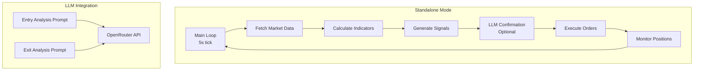
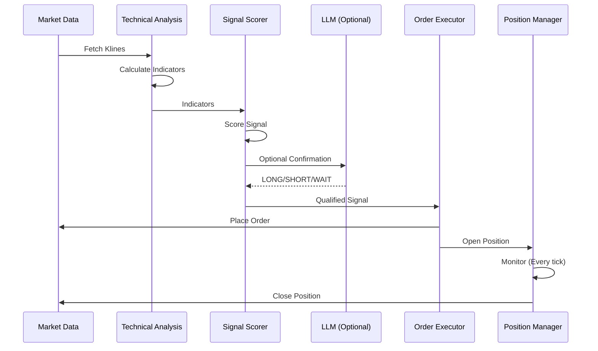

# FlashScalper Architecture

## Overview

FlashScalper is a high-performance crypto scalping bot with LLM-assisted decision making. It uses structured LLM prompts for trade confirmation, not an agent framework.

## System Architecture



## Data Flow



## Deployment Modes

### Mode 1: Standalone Scalper

Single-process trading bot that runs the complete trading loop in one process.

**File**: `src/strategies/scalper-strategy.ts`

**Architecture**:
```
┌─────────────────────────────────────────┐
│      STANDALONE SCALPER PROCESS         │
├─────────────────────────────────────────┤
│                                         │
│  Main Loop (5s tick)                    │
│    ├─ Fetch Market Data                 │
│    ├─ Calculate Indicators              │
│    ├─ Generate Signals                  │
│    ├─ LLM Confirmation (optional)       │
│    ├─ Execute Orders                    │
│    └─ Monitor Positions                 │
│                                         │
└─────────────────────────────────────────┘
```

**Use Cases**:
- Development and testing
- Single user deployment
- Quick setup (no Redis required)

### Mode 2: Distributed Workers

BullMQ-based distributed job processing with separate workers for signals, execution, and position management.

**Files**: `src/workers/*.ts`, `src/queues/index.ts`

**Architecture**:
```
┌─────────────────────────────────────────┐
│         DISTRIBUTED WORKERS             │
├─────────────────────────────────────────┤
│                                         │
│  ┌──────────┐    ┌──────────┐          │
│  │  Signal  │───▶│Execution │          │
│  │  Worker  │    │  Worker  │          │
│  └──────────┘    └──────────┘          │
│       │                │               │
│       └────────┬────────┘               │
│                ▼                        │
│         ┌──────────────┐                │
│         │    REDIS     │                │
│         │   (BullMQ)   │                │
│         └──────────────┘                │
│                                         │
└─────────────────────────────────────────┘
```

**Use Cases**:
- Multi-tenant platform
- Horizontal scaling
- High throughput

### Mode 3: API Server

REST API + WebSocket server for multi-user access.

**File**: `src/api/server.ts`

**Architecture**:
```
┌─────────────────────────────────────────┐
│           API SERVER MODE               │
├─────────────────────────────────────────┤
│                                         │
│  ┌─────────────┐                       │
│  │  REST API    │                       │
│  │  (Express)   │                       │
│  └─────────────┘                       │
│         │                               │
│         ▼                               │
│  ┌─────────────┐                       │
│  │  WebSocket  │                       │
│  │   Server    │                       │
│  └─────────────┘                       │
│         │                               │
│         ▼                               │
│  Workers/Queues (Mode 2)                │
│                                         │
└─────────────────────────────────────────┘
```

**Use Cases**:
- Multi-user platform
- Web dashboard
- External integrations

## Signal Generation Flow

```
Market Data (Klines)
    ↓
Technical Indicators (RSI, MACD, EMA, etc.)
    ↓
Signal Scoring (Multi-indicator confluence)
    ↓
LLM Confirmation (Optional - Structured Outputs with Zod)
    ├─ Rate Limiter (Token Bucket)
    ├─ Circuit Breaker (CLOSED/OPEN/HALF_OPEN)
    ├─ Retry Logic (Exponential Backoff)
    └─ Error Handling (Categorized Errors)
    ↓
Signal Validation (Filters, Risk Checks)
    ↓
Order Execution
```

## LLM Integration

### Architecture

The LLM integration uses structured prompts, not an agent framework:

- Receives structured data (indicators, price, position info)
- Returns structured JSON decisions (LONG/SHORT/WAIT, HOLD/EXIT)
- Cannot call tools (can't fetch data or execute trades)
- Has no memory (each call is independent)
- No reasoning chains (single-shot prompts)

### Production Features

- Structured Outputs: Zod schemas for type-safe LLM responses
- Retry Logic: Exponential backoff for transient failures
- Circuit Breaker: Prevents cascading failures
- Rate Limiting: Token bucket algorithm
- Error Handling: Categorized errors (timeout, rate limit, validation, service)
- Graceful Degradation: Falls back to technical analysis on LLM errors
- Metrics: Comprehensive observability

### Why Not Agentic?

This design prioritizes speed (100-500ms) and reliability over sophistication:

- Speed: Critical for scalping (need fast decisions)
- Reliability: Fewer failure points (no tool calling errors)
- Cost: Simpler prompts are cheaper and faster
- Latency: Single-shot prompts are faster than multi-step reasoning

## Technical Stack

### Core Technologies

- Language: TypeScript
- Runtime: Node.js 18+
- Exchange Client: Custom Aster DEX client
- LLM: OpenRouter API (DeepSeek model)
- Logging: Pino (structured JSON logging)
- Metrics: Prometheus

### Optional Technologies

- Redis: For distributed workers (Mode 2)
- BullMQ: Job queue system (Mode 2)
- Express: REST API server (Mode 3)
- Socket.io: WebSocket server (Mode 3)

## Component Architecture

### Services

#### Signal Service (`src/services/signal/`)

- `technical-analysis.ts`: Calculates all technical indicators
- `signal-scorer.ts`: Scores signals based on indicator confluence
- `llm-analyzer.ts`: LLM confirmation (structured prompts)
- `index.ts`: Main signal generation orchestration

#### Execution Service (`src/services/execution/`)

- `exchange-client.ts`: Aster DEX API client
- `order-executor.ts`: Order execution with risk checks

#### Position Service (`src/services/position/`)

- `position-manager.ts`: Position monitoring, P&L tracking, exit logic

### Utilities

- `retry.ts`: Generic retry with exponential backoff
- `circuit-breaker.ts`: Circuit breaker pattern implementation
- `rate-limiter.ts`: Token bucket rate limiting
- `logger.ts`: Structured logging with Pino
- `metrics.ts`: Prometheus metrics

## See Also

- [DECISIONS.md](./DECISIONS.md) - Architectural decision records
- [CONTRIBUTING.md](./CONTRIBUTING.md) - Contribution guidelines
